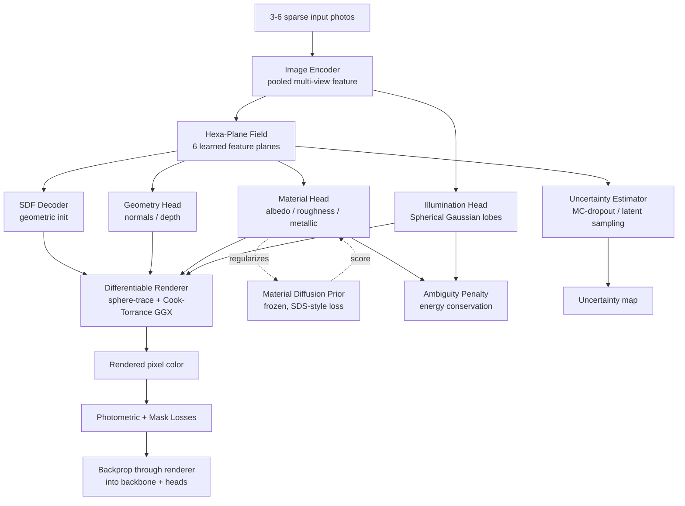
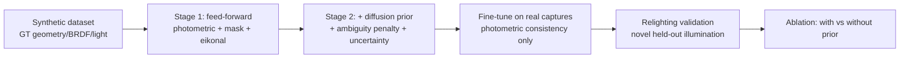

# Architecture

## End-to-end data flow

## Training stages

## Key design decisions

- **Hexa-Plane over a dense voxel grid or full transformer**: three spatial
  planes (tri-plane decomposition) plus three auxiliary planes modulated by a
  pooled multi-view image feature give cheap cross-view fusion without an
  expensive per-point attention pass, keeping inference in the "seconds on a
  consumer GPU" regime.
- **Decoupled heads**: geometry, material, and illumination are architecturally
  separate consumers of the shared Hexa-Plane feature. This is what lets the
  diffusion prior (Phase 3) attach only to the material head's latent/output
  without disturbing geometry or lighting estimation.
- **SG lighting**: a mixture of Spherical Gaussians gives a compact,
  differentiable, closed-form-integrable low-frequency environment
  representation -- cheap enough to predict from a single feed-forward head,
  and trivial to swap for a *novel* held-out environment at relighting-eval time.
- **SDS-style diffusion-prior loss**: rather than running the material head's
  output through the full diffusion sampling loop at every training step
  (expensive), we use a Score-Distillation-Sampling-style loss: one prior
  forward pass yields a score/denoised-target that nudges the material
  prediction toward the prior's learned manifold.
- **Self-contained differentiable renderer**: implemented in pure PyTorch
  (sphere-traced SDF + analytic Cook-Torrance/GGX) so the project has no hard
  dependency on `nvdiffrast`/`redner`; swapping in a rasterization-based
  renderer for mesh-based assets is a drop-in change since `shade()` only
  consumes per-pixel (point, normal, material) buffers.
